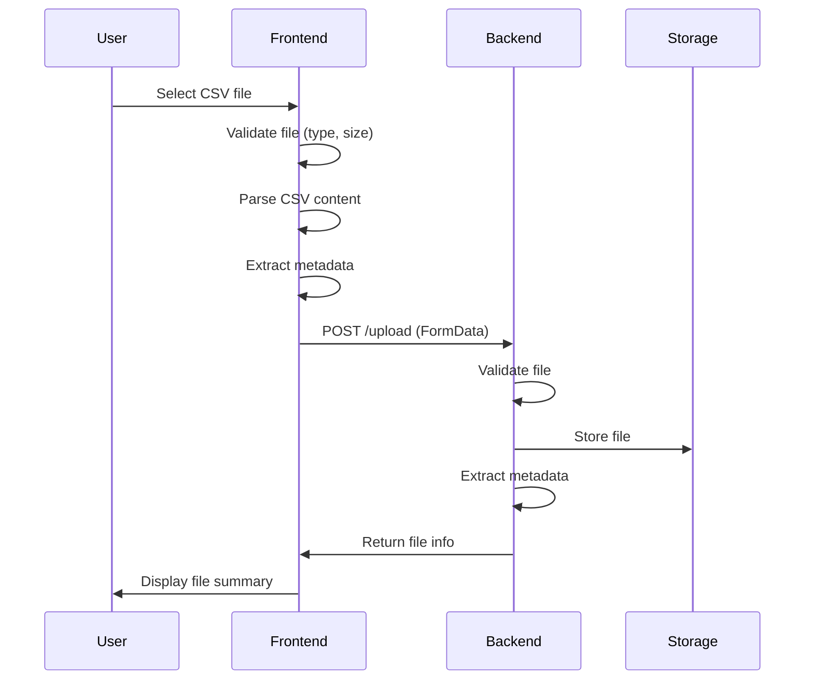
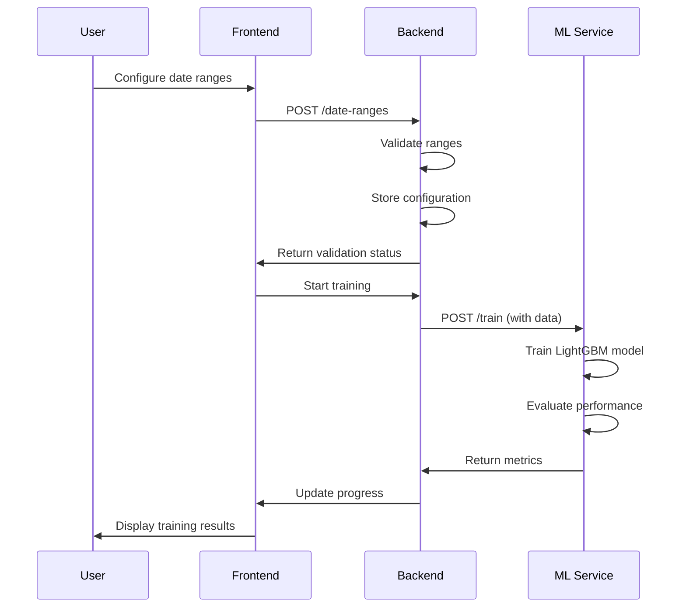
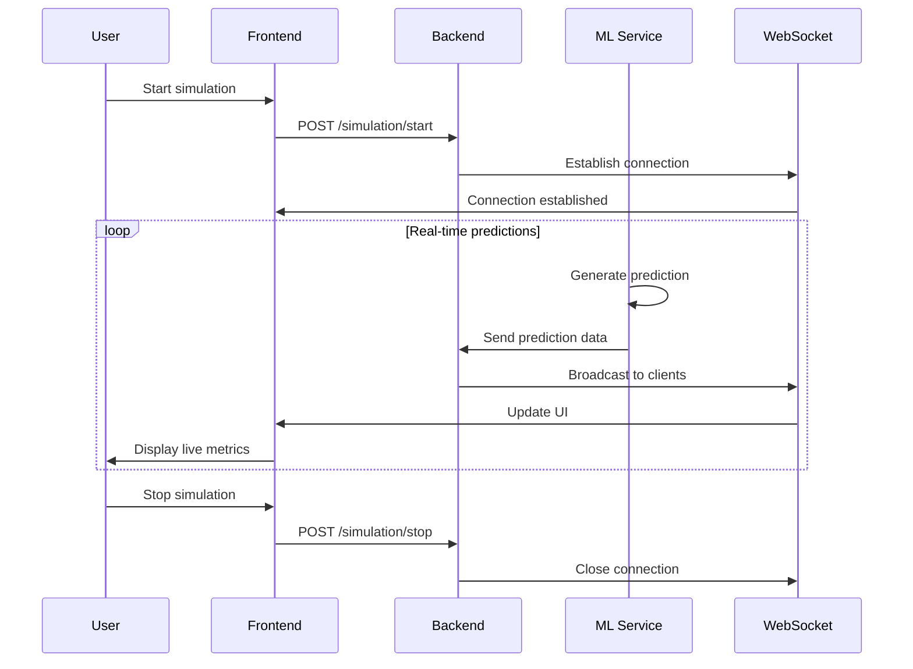

# MiniML - Predictive Quality Control System
## Design Document

**Version:** 1.0  
**Date:** August 21, 2025  
**Authors:** Sankalp Jain, Achyuth Samavedhi, Vineet Anand Modi

---

## 📋 Table of Contents

1. [System Overview](#system-overview)
2. [System Architecture](#system-architecture)
3. [Data Flow Diagrams](#data-flow-diagrams)
4. [API Contracts](#api-contracts)
5. [Data Models](#data-models)
6. [State Management](#state-management)
7. [Security Design](#security-design)
8. [Performance Considerations](#performance-considerations)
9. [Testing Strategy](#testing-strategy)
10. [Deployment Architecture](#deployment-architecture)
11. [Monitoring & Logging](#monitoring--logging)
12. [Future Enhancements](#future-enhancements)

---

## 🎯 System Overview

### Purpose
MiniML is a comprehensive machine learning application for predictive quality control that transforms raw manufacturing data into intelligent quality predictions using real-time machine learning models.

### Key Features
- **4-Step Wizard Interface**: Guided workflow from data upload to real-time simulation
- **Real-time Processing**: Live quality predictions with WebSocket communication
- **Machine Learning Pipeline**: LightGBM-based model training and evaluation
- **Modern Web Interface**: Angular 18+ with responsive design
- **Microservices Architecture**: Scalable backend with FastAPI and Python ML services

### Technology Stack
- **Frontend**: Angular 18+, TypeScript, SCSS
- **Backend**: FastAPI, Python 3.11, WebSockets
- **ML Service**: LightGBM, Pandas, Scikit-learn
- **Deployment**: Docker, Docker Compose, Nginx

---

## 🏗️ System Architecture

### High-Level Architecture Diagram

```
┌─────────────────────────────────────────────────────────────────────────────┐
│                           MiniML - Predictive Quality Control              │
├─────────────────────────────────────────────────────────────────────────────┤
│                                                                             │
│  ┌─────────────────┐    HTTP/WebSocket    ┌─────────────────┐    HTTP      │
│  │   Angular 18+   │ ◄──────────────────► │   FastAPI       │ ◄──────────► │
│  │   Frontend      │                      │   Backend       │              │
│  │   (Port 4200)   │                      │   (Port 8000)   │              │
│  └─────────────────┘                      └─────────────────┘              │
│         │                                         │                        │
│         │                                         │                        │
│         │                                         │                        │
│  ┌─────────────────┐                      ┌─────────────────┐              │
│  │   WebSocket     │                      │   Python ML     │              │
│  │   Connection    │                      │   Service       │              │
│  │   (Real-time)   │                      │   (Port 8001)   │              │
│  └─────────────────┘                      └─────────────────┘              │
│                                                                             │
└─────────────────────────────────────────────────────────────────────────────┘
```

### Component Architecture

```
┌─────────────────────────────────────────────────────────────────────────────┐
│                              Frontend (Angular 18+)                        │
├─────────────────────────────────────────────────────────────────────────────┤
│                                                                             │
│  ┌─────────────────┐  ┌─────────────────┐  ┌─────────────────┐              │
│  │   App Component │  │   Upload        │  │   Data Mapping  │              │
│  │   (Main Layout) │  │   Component     │  │   Component     │              │
│  └─────────────────┘  └─────────────────┘  └─────────────────┘              │
│           │                    │                    │                       │
│           │                    │                    │                       │
│  ┌─────────────────┐  ┌─────────────────┐  ┌─────────────────┐              │
│  │   Model         │  │   Simulation    │  │   Shared        │              │
│  │   Training      │  │   Component     │  │   Services      │              │
│  │   Component     │  │                 │  │                 │              │
│  └─────────────────┘  └─────────────────┘  └─────────────────┘              │
│                                                                             │
└─────────────────────────────────────────────────────────────────────────────┘

┌─────────────────────────────────────────────────────────────────────────────┐
│                              Backend (FastAPI)                             │
├─────────────────────────────────────────────────────────────────────────────┤
│                                                                             │
│  ┌─────────────────┐  ┌─────────────────┐  ┌─────────────────┐              │
│  │   Upload        │  │   Training      │  │   Simulation    │              │
│  │   Router        │  │   Router        │  │   Router        │              │
│  └─────────────────┘  └─────────────────┘  └─────────────────┘              │
│           │                    │                    │                       │
│           │                    │                    │                       │
│  ┌─────────────────┐  ┌─────────────────┐  ┌─────────────────┐              │
│  │   WebSocket     │  │   Data Models   │  │   Connection    │              │
│  │   Manager       │  │   (Pydantic)    │  │   Manager       │              │
│  └─────────────────┘  └─────────────────┘  └─────────────────┘              │
│                                                                             │
└─────────────────────────────────────────────────────────────────────────────┘

┌─────────────────────────────────────────────────────────────────────────────┐
│                           ML Service (Python)                              │
├─────────────────────────────────────────────────────────────────────────────┤
│                                                                             │
│  ┌─────────────────┐  ┌─────────────────┐  ┌─────────────────┐              │
│  │   Model         │  │   Prediction    │  │   Performance   │              │
│  │   Training      │  │   Engine        │  │   Metrics       │              │
│  │   (LightGBM)    │  │                 │  │                 │              │
│  └─────────────────┘  └─────────────────┘  └─────────────────┘              │
│                                                                             │
└─────────────────────────────────────────────────────────────────────────────┘
```

### Deployment Architecture

```
┌─────────────────────────────────────────────────────────────────────────────┐
│                           Production Environment                           │
├─────────────────────────────────────────────────────────────────────────────┤
│                                                                             │
│  ┌─────────────────┐  ┌─────────────────┐  ┌─────────────────┐              │
│  │   Nginx         │  │   FastAPI       │  │   Python ML     │              │
│  │   (Port 3000)   │  │   (Port 8000)   │  │   (Port 8001)   │              │
│  │   - Static      │  │   - API Gateway │  │   - Model       │              │
│  │   - Proxy       │  │   - WebSocket   │  │   - Predictions │              │
│  └─────────────────┘  └─────────────────┘  └─────────────────┘              │
│           │                    │                    │                       │
│           └────────────────────┼────────────────────┘                       │
│                                │                                            │
│  ┌─────────────────────────────────────────────────────────────────────┐    │
│  │                    Docker Network                                  │    │
│  │                    (miniml-network)                                │    │
│  └─────────────────────────────────────────────────────────────────────┘    │
│                                                                             │
└─────────────────────────────────────────────────────────────────────────────┘
```

---

## 🔄 Data Flow Diagrams

### 1. Data Upload Flow



### 2. Model Training Flow



### 3. Real-time Simulation Flow



### 4. Complete Application Flow

```
┌─────────────────┐    ┌─────────────────┐    ┌─────────────────┐
│   Data Upload   │───▶│  Data Mapping   │───▶│ Model Training  │
│   (Step 1)      │    │   (Step 2)      │    │   (Step 3)      │
└─────────────────┘    └─────────────────┘    └─────────────────┘
         │                       │                       │
         ▼                       ▼                       ▼
┌─────────────────────────────────────────────────────────────────┐
│                    Real-time Simulation                        │
│                        (Step 4)                                │
│  ┌─────────────┐  ┌─────────────┐  ┌─────────────┐            │
│  │ Live Metrics│  │ Predictions │  │ Quality     │            │
│  │             │  │ History     │  │ Trends      │            │
│  └─────────────┘  └─────────────┘  └─────────────┘            │
└─────────────────────────────────────────────────────────────────┘
```

---

## 🔌 API Contracts

### Backend API (Port 8000)

#### 1. Upload Endpoints

**POST /upload**
```json
// Request (multipart/form-data)
{
  "file": "CSV file content"
}

// Response
{
  "success": true,
  "file_id": "uuid-12345",
  "metadata": {
    "filename": "quality_data.csv",
    "file_size": 1024000,
    "columns": 15,
    "rows": 1000,
    "missing_values": "2.3%",
    "upload_time": "2025-08-21T10:30:00Z"
  }
}
```

**GET /files**
```json
// Response
{
  "files": [
    {
      "file_id": "uuid-12345",
      "filename": "quality_data.csv",
      "file_size": 1024000,
      "upload_time": "2025-08-21T10:30:00Z",
      "status": "uploaded"
    }
  ]
}
```

**DELETE /files/{file_id}**
```json
// Response
{
  "success": true,
  "message": "File deleted successfully"
}
```

#### 2. Training Endpoints

**POST /date-ranges**
```json
// Request
{
  "training": {
    "start_date": "2023-01-01",
    "end_date": "2023-08-31",
    "days": 243
  },
  "testing": {
    "start_date": "2023-09-01",
    "end_date": "2023-10-31",
    "days": 61
  },
  "simulation": {
    "start_date": "2023-11-01",
    "end_date": "2023-12-31",
    "days": 61
  }
}

// Response
{
  "success": true,
  "validation": {
    "is_valid": true,
    "message": "Date ranges are valid"
  }
}
```

**POST /training-complete**
```json
// Request
{
  "model_id": "model-12345",
  "metrics": {
    "accuracy": 94.2,
    "precision": 92.8,
    "recall": 91.5,
    "f1_score": 92.1
  },
  "training_time": 45.2
}

// Response
{
  "success": true,
  "message": "Training completed successfully"
}
```

#### 3. Simulation Endpoints

**POST /simulation/start**
```json
// Request
{
  "model_id": "model-12345",
  "simulation_config": {
    "prediction_interval": 2000,
    "max_predictions": 100
  }
}

// Response
{
  "success": true,
  "simulation_id": "sim-12345",
  "message": "Simulation started"
}
```

**POST /simulation/stop**
```json
// Request
{
  "simulation_id": "sim-12345"
}

// Response
{
  "success": true,
  "message": "Simulation stopped",
  "statistics": {
    "total_predictions": 45,
    "accuracy": 87.5,
    "duration": 90.5
  }
}
```

**WebSocket /ws/simulation**
```json
// Message Format
{
  "type": "prediction",
  "timestamp": "2025-08-21T10:35:00Z",
  "data": {
    "sample_id": "SAMPLE-123",
    "prediction": "Pass",
    "confidence": 92.5,
    "quality_score": 85.2,
    "computation_time": 89
  }
}
```

### ML Service API (Port 8001)

#### 1. Training Endpoints

**POST /train**
```json
// Request
{
  "train_data": [
    {
      "feature1": 0.5,
      "feature2": 0.3,
      "feature3": 0.8,
      "Response": 1
    }
  ],
  "test_data": [
    {
      "feature1": 0.6,
      "feature2": 0.4,
      "feature3": 0.7,
      "Response": 0
    }
  ],
  "model_config": {
    "objective": "binary",
    "random_state": 42,
    "n_estimators": 100
  }
}

// Response
{
  "success": true,
  "model_id": "model-12345",
  "metrics": {
    "accuracy": 94.2,
    "precision": 92.8,
    "recall": 91.5,
    "f1_score": 92.1,
    "confusion_matrix": {
      "true_negatives": 45,
      "false_positives": 3,
      "false_negatives": 2,
      "true_positives": 50
    }
  },
  "training_time": 45.2,
  "model_size": 1024000
}
```

#### 2. Prediction Endpoints

**POST /predict**
```json
// Request
{
  "model_id": "model-12345",
  "data": {
    "feature1": 0.5,
    "feature2": 0.3,
    "feature3": 0.8
  }
}

// Response
{
  "prediction": "Pass",
  "confidence": 92.5,
  "probabilities": {
    "Pass": 0.925,
    "Fail": 0.075
  },
  "computation_time": 89
}
```

**GET /metrics**
```json
// Response
{
  "model_id": "model-12345",
  "performance": {
    "accuracy": 94.2,
    "precision": 92.8,
    "recall": 91.5,
    "f1_score": 92.1
  },
  "usage_stats": {
    "total_predictions": 1250,
    "average_response_time": 95,
    "last_used": "2025-08-21T10:35:00Z"
  }
}
```

---

## 📊 Data Models

### Frontend Data Models

**FileSummary Interface**
```typescript
interface FileSummary {
  fileName: string;
  fileSize: string;
  columns: number;
  rows: number;
  missingValues: string;
  lastUpload: string;
}
```

**DateRange Interface**
```typescript
interface DateRange {
  startDate: string;
  endDate: string;
  days: number;
}
```

**TrainingMetrics Interface**
```typescript
interface TrainingMetrics {
  accuracy: number;
  precision: number;
  recall: number;
  f1Score: number;
}
```

**Prediction Interface**
```typescript
interface Prediction {
  time: string;
  sampleId: string;
  prediction: string;
  confidence: number;
  computationTime: number;
  threshold: number;
  correct: boolean;
}
```

### Backend Data Models (Pydantic)

**FileUpload Model**
```python
class FileUpload(BaseModel):
    file_id: str
    filename: str
    file_size: int
    columns: int
    rows: int
    missing_values: str
    upload_time: datetime
    status: str
```

**DateRanges Model**
```python
class DateRanges(BaseModel):
    training: DateRange
    testing: DateRange
    simulation: DateRange

class DateRange(BaseModel):
    start_date: str
    end_date: str
    days: int
```

**TrainingComplete Model**
```python
class TrainingComplete(BaseModel):
    model_id: str
    metrics: TrainingMetrics
    training_time: float

class TrainingMetrics(BaseModel):
    accuracy: float
    precision: float
    recall: float
    f1_score: float
```

### ML Service Data Models

**TrainRequest Model**
```python
class TrainRequest(BaseModel):
    train_data: List[Dict[str, Any]]
    test_data: List[Dict[str, Any]]
    model_config: Optional[Dict[str, Any]] = None
```

**PredictRequest Model**
```python
class PredictRequest(BaseModel):
    model_id: str
    data: Dict[str, Any]
```

**PredictResponse Model**
```python
class PredictResponse(BaseModel):
    prediction: str
    confidence: float
    probabilities: Dict[str, float]
    computation_time: int
```

---

## 🔄 State Management

### Frontend State Management

**Component-Level State**
```typescript
// Upload Component State
interface UploadState {
  selectedFile: File | null;
  fileSummary: FileSummary | null;
  isUploading: boolean;
  uploadSuccess: boolean;
}

// Data Mapping Component State
interface DataMappingState {
  trainingPeriod: DateRange;
  testingPeriod: DateRange;
  simulationPeriod: DateRange;
  isValidationSuccess: boolean;
}

// Model Training Component State
interface TrainingState {
  isTraining: boolean;
  trainingProgress: number;
  trainingComplete: boolean;
  metrics: TrainingMetrics;
}

// Simulation Component State
interface SimulationState {
  isSimulationRunning: boolean;
  qualityScore: number;
  confidence: number;
  liveStats: LiveStats;
  predictions: Prediction[];
}
```

### Backend State Management

**In-Memory Storage**
```python
# Global state storage
uploaded_files: Dict[str, FileUpload] = {}
training_state: Dict[str, TrainingState] = {}
date_ranges: Dict[str, DateRanges] = {}
simulation_state: Dict[str, SimulationState] = {}

# WebSocket connections
active_connections: List[WebSocket] = []
```

---

## 🔒 Security Design

### Frontend Security
- **Input Validation**: Client-side validation for all user inputs
- **XSS Prevention**: Angular's built-in XSS protection
- **CORS Configuration**: Proper cross-origin handling
- **Content Security Policy**: Restricted resource loading

### Backend Security
- **Request Validation**: Pydantic models ensure data integrity
- **CORS Middleware**: Controlled cross-origin access
- **Error Handling**: Secure error responses without sensitive information
- **Input Sanitization**: All inputs validated and sanitized

### ML Service Security
- **Model Isolation**: Secure model storage and access
- **Input Validation**: Data validation before processing
- **Rate Limiting**: Prevent abuse of prediction endpoints
- **Model Versioning**: Secure model version management

### Data Security
- **File Validation**: Strict file type and size validation
- **Data Encryption**: Sensitive data encrypted in transit
- **Access Control**: Role-based access control (future enhancement)
- **Audit Logging**: Comprehensive logging of all operations

---

## ⚡ Performance Considerations

### Frontend Performance
- **Lazy Loading**: Component-based code splitting
- **Angular Universal**: Server-side rendering support
- **Bundle Optimization**: Tree shaking and minification
- **Caching Strategy**: Browser caching for static assets

### Backend Performance
- **Async Operations**: Non-blocking I/O operations
- **Connection Pooling**: Efficient database connections
- **Caching**: In-memory data caching
- **Load Balancing**: Horizontal scaling capability

### ML Service Performance
- **Model Caching**: Trained model persistence
- **Batch Processing**: Efficient data processing
- **Memory Management**: Optimized memory usage
- **Model Optimization**: LightGBM for fast predictions

### Database Performance
- **Indexing Strategy**: Optimized database indexes
- **Query Optimization**: Efficient database queries
- **Connection Management**: Connection pooling
- **Data Partitioning**: Large dataset handling

---

## 🧪 Testing Strategy

### Frontend Testing
- **Unit Tests**: Component and service testing with Jasmine
- **E2E Tests**: End-to-end user flow testing with Protractor
- **Integration Tests**: API integration testing
- **Visual Regression Tests**: UI consistency testing

### Backend Testing
- **API Tests**: Endpoint functionality testing with pytest
- **Unit Tests**: Business logic testing
- **Integration Tests**: Service integration testing
- **Performance Tests**: Load and stress testing

### ML Service Testing
- **Model Tests**: Model accuracy and performance testing
- **API Tests**: Prediction endpoint testing
- **Data Tests**: Data validation and processing testing
- **A/B Testing**: Model comparison testing

### Test Coverage Goals
- **Frontend**: 80%+ code coverage
- **Backend**: 85%+ code coverage
- **ML Service**: 90%+ code coverage
- **Integration**: 95%+ feature coverage

---

## 🚀 Deployment Architecture

### Development Environment
```
┌─────────────────┐  ┌─────────────────┐  ┌─────────────────┐
│   Angular Dev   │  │   FastAPI Dev   │  │   ML Service    │
│   Server        │  │   Server        │  │   Dev Server    │
│   (Port 4200)   │  │   (Port 8000)   │  │   (Port 8001)   │
└─────────────────┘  └─────────────────┘  └─────────────────┘
```

### Production Environment
```
┌─────────────────────────────────────────────────────────────────┐
│                        Load Balancer                           │
└─────────────────────────────────────────────────────────────────┘
                                │
                ┌───────────────┼───────────────┐
                │               │               │
        ┌───────▼──────┐ ┌──────▼──────┐ ┌──────▼──────┐
        │   Frontend   │ │   Backend   │ │   ML        │
        │   Container  │ │   Container │ │   Service   │
        │   (Nginx)    │ │   (FastAPI) │ │   Container │
        └──────────────┘ └─────────────┘ └─────────────┘
```

### Docker Configuration
```yaml
# docker-compose.yml
version: '3.8'
services:
  frontend-angular:
    build: ./frontend
    ports: ["3000:80"]
    depends_on: [backend-dotnet]
    
  backend-dotnet:
    build: ./backend
    ports: ["8000:8000"]
    depends_on: [ml-service-python]
    
  ml-service-python:
    build: ./ml-service-python
    ports: ["8001:8000"]
    
networks:
  miniml-network:
    driver: bridge
```

---

## 📈 Monitoring & Logging

### Application Monitoring
- **Health Checks**: Service health monitoring endpoints
- **Performance Metrics**: Response time and throughput monitoring
- **Error Tracking**: Comprehensive error logging and alerting
- **Resource Monitoring**: CPU, memory, and disk usage tracking

### ML Model Monitoring
- **Model Performance**: Accuracy and drift monitoring
- **Prediction Logging**: Prediction history and analysis
- **Data Quality**: Input data validation and monitoring
- **Model Versioning**: Model version tracking and rollback

### Logging Strategy
```python
# Structured logging format
{
  "timestamp": "2025-08-21T10:35:00Z",
  "level": "INFO",
  "service": "miniml-backend",
  "endpoint": "/upload",
  "user_id": "user-123",
  "request_id": "req-456",
  "message": "File uploaded successfully",
  "metadata": {
    "file_size": 1024000,
    "processing_time": 1.2
  }
}
```

### Alerting System
- **Error Rate Alerts**: High error rate notifications
- **Performance Alerts**: Slow response time alerts
- **Model Drift Alerts**: Model performance degradation alerts
- **Resource Alerts**: High resource usage notifications

---

## 🔮 Future Enhancements

### Short-term Enhancements (3-6 months)
- **User Authentication**: JWT-based authentication system
- **Database Integration**: PostgreSQL for persistent storage
- **Model Versioning**: MLflow integration for model management
- **Advanced Analytics**: Detailed performance analytics dashboard

### Medium-term Enhancements (6-12 months)
- **Multi-tenant Support**: Organization-based data isolation
- **Advanced ML Models**: Support for multiple ML algorithms
- **Real-time Alerts**: Configurable alerting system
- **API Rate Limiting**: Advanced rate limiting and throttling

### Long-term Enhancements (12+ months)
- **Microservices Architecture**: Complete service decomposition
- **Kubernetes Deployment**: Container orchestration
- **Machine Learning Pipeline**: Automated ML pipeline
- **Advanced Security**: OAuth2, RBAC, and audit trails

### Technology Upgrades
- **Angular 19+**: Latest Angular framework features
- **FastAPI 1.0+**: Latest FastAPI features
- **Python 3.12+**: Latest Python features
- **Docker Compose v3**: Latest orchestration features

---

## 📝 Conclusion

This design document outlines a comprehensive architecture for the MiniML Predictive Quality Control system. The system is designed to be scalable, maintainable, and extensible, with clear separation of concerns and modern development practices.

The architecture supports:
- **Real-time processing** with WebSocket communication
- **Scalable microservices** with Docker containerization
- **Modern web interface** with Angular 18+
- **Robust ML pipeline** with LightGBM and FastAPI
- **Comprehensive monitoring** and logging
- **Security best practices** throughout the stack

The system is ready for production deployment and can be extended with additional features as outlined in the future enhancements section.

---

**Document Version:** 1.0  
**Last Updated:** August 21, 2025  
**Next Review:** September 21, 2025

**Developed By:**
- **Sankalp Jain** 
- **Achyuth Samavedhi**   
- **Vineet Anand Modi** 
